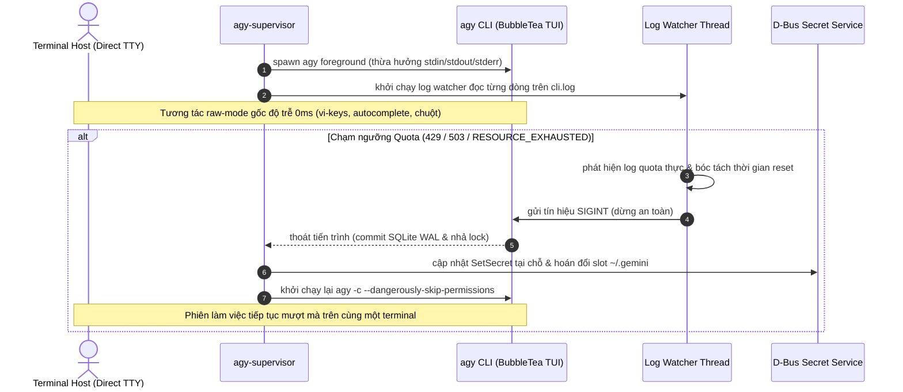

# agy-supervisor

Engine điều phối đa tài khoản và tự động chuyển đổi phiên (session failover) khi chạm ngưỡng quota cho Google Antigravity CLI (`agy`) trên Linux.

Chạy trực tiếp `agy` trên foreground TTY của host, bắt lỗi cạn kiệt quota theo thời gian thực qua cơ chế streaming log evaluation, hoán đổi nóng thông tin xác thực OAuth giữa $N$ slot tài khoản (đồng bộ cấp tệp tin và D-Bus Secret Service), đồng thời tiếp tục chính xác ngữ cảnh hội thoại qua lệnh `agy -c` cùng cờ `--dangerously-skip-permissions`.

---

## Kiến trúc hệ thống (Architecture)



---

## Yêu cầu hệ thống & Cài đặt

### Yêu cầu
- Linux (x86_64 / aarch64)
- Python 3.8+
- Thư viện D-Bus Python (`python3-dbus`)
- Antigravity CLI (`agy`) đã cài đặt và có trong `$PATH`

### Cài đặt
```bash
git clone https://github.com/Tc3s/Gr33d-4gy.git
cd Gr33d-4gy
./install.sh -y
```

Binary thực thi được cài đặt vào `~/.local/bin/agy-supervisor` kèm alias `agys` được cấu hình tự động trong `~/.bashrc` / `~/.zshrc`.

---

## Danh mục lệnh CLI (CLI Reference)

| Lệnh | Mô tả |
| :--- | :--- |
| `agy-supervisor [args...]` | Khởi chạy phiên làm việc foreground với auto-failover và cờ `--dangerously-skip-permissions` |
| `agy-supervisor status` | Hiển thị bảng trạng thái tất cả slot, slot đang kích hoạt, và đồng hồ cooldown |
| `agy-supervisor add` | Tạo Slot $N+1$ mới và khởi chạy quy trình đăng nhập OAuth |
| `agy-supervisor login <N>` | Xác thực hoặc đăng nhập lại tài khoản Google cho Slot $N$ |
| `agy-supervisor switch <N>` | Chuyển đổi trực tiếp thông tin xác thực sang Slot $N$ ngay lập tức |
| `agy-supervisor save <N>` | Lưu thông tin xác thực hiện tại từ `~/.gemini/` vào Slot $N$ |
| `agy-supervisor reset [all\|<N>]` | Xóa trạng thái cooldown quota và đưa các slot về lại `ACTIVE` |
| `agy-supervisor setup` | Trình hướng dẫn tương tác để kiểm tra và cấu hình toàn bộ các slot |

---

## Đặc tả kỹ thuật (Technical Specifications)

### 1. Thực thi trực tiếp trên Foreground TTY (Direct TTY Execution)
- Khởi chạy `agy` kế thừa trực tiếp các file descriptor tiêu chuẩn (`fd 0, 1, 2`).
- Triệt tiêu độ trễ của PTY proxy, hiện tượng vỡ con trỏ raw-mode, và lỗi lệch kích thước màn hình (`SIGWINCH`).
- Context manager `TerminalGuard` khôi phục buffer màn hình gốc (`\x1b[?1049l`) và hiển thị con trỏ (`\x1b[?25h`) khi tiến trình kết thúc hoặc gặp ngoại lệ.

### 2. Đồng bộ hóa Credential hai lớp (Dual-Layer Credential Sync)
- **Tệp tin (Filesystem)**: Sao chép đồng bộ `oauth_creds.json` và `google_accounts.json` vào `~/.gemini_accounts/<slot>/` với phân quyền bảo mật nghiêm ngặt `0600`.
- **GNOME Keyring (D-Bus Secret Service)**: Giao tiếp trực tiếp với `org.freedesktop.secrets`, cập nhật secret tại chỗ thông qua `item.SetSecret(...)` nếu đã có, hoặc tạo item mới trong collection `/aliases/default` (fallback `/collection/login`). Chống rò rỉ token và tránh việc đọc phải cache cũ của keyring.

### 3. Giám sát Log Stream có bộ đệm dòng (Line-Buffered Log Stream Watcher)
- Đọc `cli.log` liên tục bằng bộ đệm dòng cục bộ (`line_buffer = lines.pop()`).
- Khắc phục lỗi false negative do từ khóa bị cắt đôi tại ranh giới chunk đọc (ví dụ `RESOURCE_` ở cuối chunk 1 và `EXHAUSTED` ở đầu chunk 2).
- Phân biệt chính xác giữa lỗi cạn quota thật sự với các log thăm dò định kỳ của backend Go (ví dụ: `doRefreshQuota: skipped (throttled)` chạy ngầm cách nhau vài chục ms).
- Tự động reset con trỏ đọc về 0 khi file log bị truncate tại chỗ (`cur_size < tracked_pos`).

### 4. Thang leo thang tín hiệu chống Deadlock (Deterministic Signal Escalation)
- Để ngăn hiện tượng treo luồng chính tại `proc.wait()`, luồng giám sát thực thi thang leo thang tín hiệu:
  $$\text{SIGINT (2.5s)} \longrightarrow \text{SIGTERM (1.0s)} \longrightarrow \text{SIGKILL}$$
- Đăng ký signal handler cho `SIGTERM` và `SIGHUP` để dọn dẹp và ngắt tiến trình con sạch sẽ, tránh tạo tiến trình mồ côi (orphaned processes).

### 5. Lưu trữ trạng thái nguyên tử (Atomic State Persistence)
- Mọi thao tác ghi vào `supervisor_state.json` đều được thực hiện qua file tạm (`.tmp`), gọi lệnh `os.fsync()`, và thay thế nguyên tử chuẩn POSIX (`os.replace()`), loại trừ rủi ro hỏng dữ liệu khi tắt đột ngột.

---

## Kiểm thử & Chẩn đoán hệ thống (Testing & Diagnostics)

Repository tích hợp sẵn bộ công cụ tự động hóa qua Makefile:

```bash
# Chạy bộ hồi quy kiểm thử (19 unit & integration tests, môi trường hermetic cách ly 100%)
make test

# Thực hiện kiểm tra chẩn đoán môi trường, phân quyền, và tính hợp lệ của token
make health

# Chạy mô phỏng failover quota trực tiếp trên hệ thống (tự động sao lưu và khôi phục slot)
make verify
```

---

## Tài liệu kỹ thuật chi tiết (Documentation)

- [docs/ARCHITECTURE.md](docs/ARCHITECTURE.md): Phân tích chi tiết về TTY Linux, thang tín hiệu, D-Bus Secret Service, và cơ chế SQLite WAL.
- [docs/ANTI_ABUSE_GUIDE.md](docs/ANTI_ABUSE_GUIDE.md): Phân tích kỹ thuật về rate limiter của Google, chu kỳ reset Pacific Midnight, và các cơ chế phòng chống bị khóa tài khoản.
- [docs/TROUBLESHOOTING.md](docs/TROUBLESHOOTING.md): Hướng dẫn khắc phục khi Circuit Breaker kích hoạt, phiên SSH headless, và xung đột presence lock.

---

## Giấy phép (License)

[MIT](LICENSE)
