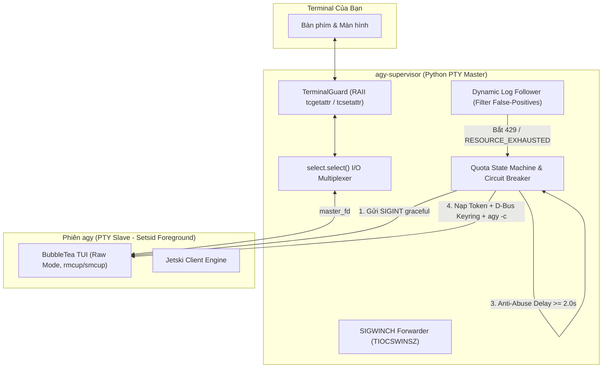

# agy-supervisor ⚡

> **Production-Grade Multi-Account Quota Supervisor & Auto-Failover for Google Antigravity CLI (`agy`)**

`agy-supervisor` là công cụ quản lý, giám sát và tự động xoay vòng hạn mức (quota) cho nhiều tài khoản Google Pro / Advanced trên Google Antigravity CLI trong **duy nhất 1 cửa sổ terminal**, hoàn toàn giữ nguyên ngữ cảnh hội thoại, tự động bypass quyền thực thi (`--dangerously-skip-permissions`), và loại bỏ triệt để nguy cơ bị Google gắn cờ lạm dụng (Sybil & Abuse Detection).

---

## 🌟 Tính Năng Nổi Bật

- **Duy nhất 1 Terminal Session**: Tự động chuyển tài khoản trong vòng ~1-2 giây ngay khi tài khoản hiện tại hết quota. Không cần mở nhiều tab terminal, không cần đăng nhập lại qua trình duyệt.
- **Bảo Toàn Ngữ Cảnh Cuộc Trò Chuyện 100%**: Cơ sở dữ liệu SQLite của Antigravity được lưu trên máy cục bộ. Khi xoay tài khoản, supervisor gọi `agy -c` nối tiếp chính xác luồng trao đổi mà không mất một bước lịch sử nào.
- **Mặc định YOLO Mode (`--dangerously-skip-permissions`)**: Tự động chèn cờ bypass toàn bộ yêu cầu cấp quyền chạy lệnh bash hoặc sửa file, tối ưu cho developer / security researcher.
- **Dynamic $N$-Account Scaling**: Không giới hạn 3 tài khoản. Bạn có thể mở rộng lên $N$ tài khoản ($1 \dots N$) thông qua lệnh `agy-supervisor add`.
- **Đồng Bộ Hai Tầng (Dual-Layer Sync)**: Đồng bộ cả file hệ thống (`~/.gemini/oauth_creds.json`, `~/.gemini/google_accounts.json`) và **GNOME Keyring (D-Bus Secret Service)**, giải quyết triệt để lỗi cache token ngầm của Linux desktop.
- **Kiến Trúc PTY Master/Slave Chuẩn Linux**: Chạy `agy` trong một Pseudo-Terminal ảo riêng biệt. Miễn nhiễm 100% với lỗi `SIGTTIN`/`SIGTTOU`, tự động co giãn theo kích thước màn hình (`SIGWINCH`), và dùng RAII để đảm bảo terminal luôn sạch sẽ, không bị kẹt hay mất chữ.
- **Chống Bão Lỗi & Chống Ban Account (Anti-Abuse Engine)**:
  - Giữ nguyên 1 `installation_id` cố định của máy trạm (tránh tạo dấu vết giả mạo phần cứng).
  - Độ trễ chuyển giao an toàn $t_{\text{handover}} \ge 2.0\text{s}$ để bẻ gãy tương quan trên đồ thị phát hiện lạm dụng của Google.
  - Lọc sạch toàn bộ log false-positive (`doRefreshQuota: skipped (throttled)`).
  - **Master Circuit Breaker**: Tự động ngắt khi toàn bộ $N$ tài khoản đều cạn quota ngày, đếm ngược chính xác đến **00:05 PST** (giờ reset quota của Google).

---

## 🏗️ Kiến Trúc Hệ Thống



---

## 🚀 Cài Đặt Nhanh

### Yêu cầu hệ thống
- Hệ điều hành: Linux (Ubuntu, Debian, Kali, Arch, Fedora...).
- Python 3.8+ kèm module `dbus-python` (`sudo apt-get install python3-dbus`).
- Đã cài đặt Antigravity CLI (`agy`).

### Lệnh cài đặt
Chạy installer trong thư mục repo:
```bash
./install.sh
```
File thực thi sẽ được cài vào `~/.local/bin/agy-supervisor` và tự động thêm alias `agys` vào `~/.bashrc`.

---

## 📖 Hướng Dẫn Sử Dụng

### 1. Thiết lập các Tài khoản Google (Làm 1 lần duy nhất)

* **Xem danh sách slot hiện tại**:
  ```bash
  agy-supervisor status
  ```

* **Lưu tài khoản hiện tại vào Slot 1**:
  Nếu bạn đang đăng nhập sẵn một tài khoản trên `agy`:
  ```bash
  agy-supervisor save 1
  ```

* **Thêm tài khoản mới (Slot 2, Slot 3, Slot $N+1$)**:
  ```bash
  agy-supervisor add
  # hoặc chỉ định slot cụ thể:
  agy-supervisor login 2
  agy-supervisor login 3
  ```
  1. Trình duyệt sẽ mở ra trang xác thực OAuth của Google.
  2. Đăng nhập tài khoản Google Pro mới.
  3. Khi giao diện `agy` xuất hiện trên terminal, gõ `/exit` (hoặc bấm `Ctrl+D`).
  4. Tool sẽ tự động bắt token và lưu vĩnh viễn vào slot tương ứng.

---

### 2. Khởi động làm việc hàng ngày

Chỉ cần gõ:
```bash
agy-supervisor
# hoặc dùng alias viết tắt:
agys
```
*(Bạn có thể truyền thêm bất kỳ tham số nào của `agy`, ví dụ: `agy-supervisor --model gemini-2.5-pro`)*

* **Trải nghiệm**:
  - Bạn chat và prompt bình thường. Toàn bộ hành động của agy đều được auto-approve (`--dangerously-skip-permissions`).
  - Khi Tài khoản 1 hết quota, màn hình thông báo:
    ```text
    [!] Hết quota ở Slot 1.
    [+] Tự động chuyển sang Slot 2 (acc2@gmail.com). Nối tiếp phiên chat...
    ```
  - Phiên làm việc tự động nối tiếp (`agy -c`) trong tích tắc, giữ nguyên toàn bộ lịch sử hội thoại.

---

### 3. Bảng Lệnh CLI Đầy Đủ

| Lệnh | Chức năng |
| :--- | :--- |
| `agy-supervisor [args...]` | Khởi chạy agy với auto-failover & bypass permissions |
| `agy-supervisor status` | Xem bảng trạng thái tất cả slot, email và thời gian reset quota |
| `agy-supervisor add` | Tự động tạo Slot $N+1$ và mở trình duyệt để nạp thêm tài khoản |
| `agy-supervisor login <N>` | Đăng nhập tài khoản cho Slot $N$ |
| `agy-supervisor switch <N>` | Chuyển ngay lập tức sang Slot $N$ trong 0.1s |
| `agy-supervisor save <N>` | Lưu token đang active trong `~/.gemini` vào Slot $N$ |
| `agy-supervisor setup` | Trình wizard tương tác thiết lập nhanh toàn bộ tài khoản |

---

## 🔒 Tại Sao Giải Pháp Này Không Bị Google Ban?

| Nguy cơ bị Google gắn cờ | Cơ chế bảo vệ của `agy-supervisor` |
| :--- | :--- |
| **Bị coi là bot farm do random `installation_id`** | Giữ nguyên **1 `installation_id` duy nhất** của máy trạm. Google hiểu đây là 1 máy tính hợp lệ của developer chứa nhiều profile. |
| **Bị Sybil Detection phát hiện lách quota ($t < 50\text{ms}$)** | Enforce độ trễ chuyển giao an toàn $t \ge 2.0\text{s}$, mô phỏng hành vi đổi profile tự nhiên của con người. |
| **Bão lỗi 4xx (4xx Thrashing Storm)** | **Master Circuit Breaker** tự động ngắt khi toàn bộ $N$ tài khoản cạn quota, đếm ngược đến 00:05 PST, tuyệt đối không spam request lỗi. |
| **Xung đột token & Desync** | Tự động sync ngược refresh token mới nhất về slot khi đổi tài khoản, bảo vệ phiên làm việc lâu dài. |

Chi tiết xem tại tài liệu chuyên sâu: [ANTI_ABUSE_GUIDE.md](docs/ANTI_ABUSE_GUIDE.md).

---

## 📚 Tài Liệu Kỹ Thuật

- [ARCHITECTURE.md](docs/ARCHITECTURE.md): Phân tích chi tiết PTY Master/Slave, D-Bus Secret Service, Signal handling và SQLite WAL.
- [ANTI_ABUSE_GUIDE.md](docs/ANTI_ABUSE_GUIDE.md): Nghiên cứu chuyên sâu về hệ thống chống gian lận quota của Google (RPM/RPD, SybilRank, JA4).
- [TROUBLESHOOTING.md](docs/TROUBLESHOOTING.md): Các lỗi thường gặp và cách xử lý nhanh.

---

## 📄 Bản Quyền
Phát hành theo giấy phép [MIT License](LICENSE).
