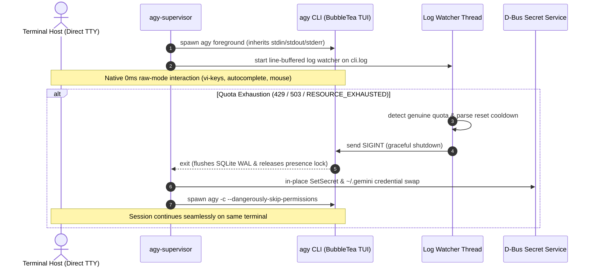

# agy-supervisor

Multi-account quota supervisor and automatic session failover engine for Google Antigravity CLI (`agy`) on Linux.

Runs `agy` directly on the host foreground TTY, intercepts quota exhaustion in real time via streaming log evaluation, hot-swaps OAuth credentials across $N$ configured account slots (both file-level and D-Bus Secret Service), and resumes the exact conversation context via `agy -c` with `--dangerously-skip-permissions` enforced.

---

## Architecture



---

## Requirements & Installation

### Requirements
- Linux (x86_64 / aarch64)
- Python 3.8+
- D-Bus Python bindings (`python3-dbus`)
- Antigravity CLI (`agy`) installed and available in `$PATH`

### Installation
```bash
git clone https://github.com/your-username/agy-supervisor.git
cd agy-supervisor
./install.sh -y
```

Binary is installed to `~/.local/bin/agy-supervisor` with alias `agys` added to `~/.bashrc` / `~/.zshrc`.

---

## CLI Reference

| Command | Description |
| :--- | :--- |
| `agy-supervisor [args...]` | Launch foreground session with auto-failover and `--dangerously-skip-permissions` |
| `agy-supervisor status` | Display status table of all configured slots, active slot, and cooldown timers |
| `agy-supervisor add` | Create Slot $N+1$ and launch OAuth login flow |
| `agy-supervisor login <N>` | Authenticate or re-authenticate Google account for Slot $N$ |
| `agy-supervisor switch <N>` | Hot-swap active credentials to Slot $N$ immediately |
| `agy-supervisor save <N>` | Snapshot active credentials from `~/.gemini/` into Slot $N$ |
| `agy-supervisor reset [all\|<N>]` | Clear quota cooldown status and mark slots `ACTIVE` |
| `agy-supervisor setup` | Interactive wizard to inspect and configure all account slots |

---

## Technical Specifications

### 1. Direct Foreground TTY Execution
- Spawns `agy` with inherited standard file descriptors (`fd 0, 1, 2`).
- Bypasses PTY proxying latency, raw-mode cursor corruption, and terminal resize desynchronization (`SIGWINCH`).
- `TerminalGuard` context manager restores normal screen buffer (`\x1b[?1049l`) and cursor visibility (`\x1b[?25h`) on any exit or exception.

### 2. Dual-Layer Credential Synchronization
- **Filesystem**: Mirrors `oauth_creds.json` and `google_accounts.json` into `~/.gemini_accounts/<slot>/` with `0600` permissions.
- **GNOME Keyring (D-Bus Secret Service)**: Directly queries `org.freedesktop.secrets`, updates secret in-place via `item.SetSecret(...)` if present, or creates item under collection `/aliases/default` (fallback `/collection/login`). Prevents credential leaking and stale keyring reads.

### 3. Line-Buffered Log Stream Watcher
- Reads `cli.log` incrementally using partial line buffering (`line_buffer = lines.pop()`).
- Eliminates chunk-boundary splitting false negatives where keywords (e.g., `RESOURCE_EXHAUSTED`) span across read buffers.
- Distinguishes genuine quota events from concurrent background logs (e.g. `doRefreshQuota: skipped (throttled)` written 50ms apart by Go goroutines).
- Automatically resets read offset to 0 if the log file is truncated in-place (`cur_size < tracked_pos`).

### 4. Deterministic Signal Escalation
- To prevent main-thread deadlocks at `proc.wait()`, the watcher thread implements a progressive escalation ladder:
  $$\text{SIGINT (2.5s)} \longrightarrow \text{SIGTERM (1.0s)} \longrightarrow \text{SIGKILL}$$
- Registers `SIGTERM` and `SIGHUP` handlers in the supervisor to cleanly terminate child processes and prevent orphaned instances.

### 5. Atomic State Persistence
- All updates to `supervisor_state.json` write to a temporary file (`.tmp`), call `os.fsync()`, and perform an atomic POSIX replace (`os.replace()`) to prevent state corruption during sudden shutdowns.

---

## Development & Diagnostics

The repository includes a comprehensive verification suite:

```bash
# Run regression test suite (19 unit & integration tests)
make test

# Perform environment, permission, and token validity audit
make health

# Run deterministic live quota failover simulation on the system
make verify
```

---

## Documentation

- [docs/ARCHITECTURE.md](docs/ARCHITECTURE.md): Detailed analysis of Linux TTY execution, signal ladders, D-Bus Secret Service, and SQLite WAL mechanics.
- [docs/ANTI_ABUSE_GUIDE.md](docs/ANTI_ABUSE_GUIDE.md): Technical analysis of Google rate limiters, Pacific Midnight reset intervals, and evasion prevention.
- [docs/TROUBLESHOOTING.md](docs/TROUBLESHOOTING.md): Remediation steps for Circuit Breaker trips, headless SSH sessions, and presence lock conflicts.

---

## License

[MIT](LICENSE)
