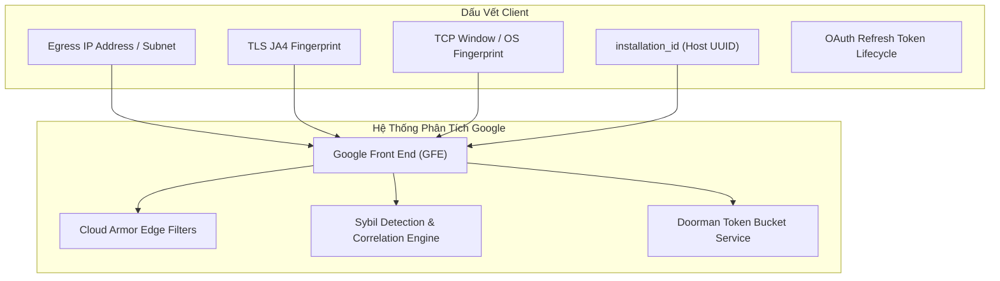

# Hướng Dẫn Kỹ Thuật: Chống Ban & Phòng Ngừa Gắn Cờ Từ Google

Tài liệu này giải thích các nguyên tắc phát hiện lạm dụng (Abuse & Sybil Detection) của Google đối với dịch vụ Gemini / Code Assist / Antigravity và lý do tại sao `agy-supervisor` an toàn tuyệt đối.

---

## 1. Cơ Chế Kiểm Duyệt Của Google Front End (GFE) & Sybil Engine

Google áp dụng hệ thống phân tích đồ thị tương quan đa chiều (Multi-Dimensional Correlation Graph) để phát hiện hành vi lạm dụng quota:



### Các thuật toán giám sát cốt lõi:
1. **SybilRank & EagleMine**: Phát hiện các cụm tài khoản (Identity Clusters) có hành vi phối hợp để vượt qua các chính sách giới hạn tài nguyên (Policy Bypassing).
2. **Doorman / Bandwidth Engine**: Quản lý các Token Bucket trượt theo thời gian thực (RPM/RPD).
3. **Cloud Armor Rate Limiters**: Đếm tỷ lệ lỗi $\frac{4xx}{2xx}$ trong sliding window để kích hoạt CAPTCHA challenge hoặc IP Blackholing.

---

## 2. Các Cờ Đỏ (Red Flags) Và Cách `agy-supervisor` Khắc Phục

### Cờ đỏ 1: The "Fast Failover" Anomaly ($t_{\Delta} < 50\text{ms}$)
* **Hiện tượng**: Khi Acc 1 bị mã lỗi `429` (Rate Limit) ở $T_0$, và Acc 2 ngay lập tức gửi prompt tiếp nối ở $T_0 + 20\text{ms}$ trên cùng IP và TLS stack.
* **Đánh giá của máy quét**: Hành vi con người không thể đổi tài khoản trong 20 mili-giây. Đây là dấu hiệu của botnet / automated script đang khai thác quota lậu.
* **Cách khắc phục trong `agy-supervisor`**:
  Supervisor luôn áp dụng **Handover Delay tối thiểu $\ge 2.0\text{s}$**:
  ```python
  # Anti-Abuse: enforce minimum handover gap (>= 2.0s)
  time.sleep(2.0)
  self.apply_slot(next_slot)
  ```
  Khoảng thời gian nghỉ này phá vỡ tương quan thời gian tức thì trên đồ thị của Sybil Engine.

---

### Cờ đỏ 2: Thay đổi `installation_id` liên tục
* **Hiện tượng**: Một số script tự động sinh ngẫu nhiên `installation_id` (UUID) mới mỗi khi đổi tài khoản.
* **Đánh giá của máy quét**: Trong khi `installation_id` thay đổi liên tục, thì địa chỉ IP, card mạng, hệ điều hành Linux, kích thước TCP Window và TLS JA4 Fingerprint lại giống hệt nhau. Google sẽ coi đây là **Active Evasion Artifact** (hành vi cố tình giả mạo phần cứng), mang trọng số phạt cực cao (10x Ban Risk).
* **Cách khắc phục trong `agy-supervisor`**:
  Supervisor **giữ nguyên 1 `installation_id` duy nhất** của máy tính bạn. Trong mô hình của Google, một máy tính của developer chứa nhiều profile Google (cá nhân, công việc, dự án) là hoàn toàn hợp lệ và tự nhiên.

---

### Cờ đỏ 3: Bão lỗi 4xx (The 4xx Thrashing Storm)
* **Hiện tượng**: Khi toàn bộ tài khoản đều đã hết quota ngày, script tiếp tục xoay vòng liên tục trong vài giây:
  $$1 \to 2 \to 3 \to 1 \to 2 \dots$$
  Hàng trăm request trả về HTTP 429 dồn dập trong 1 phút.
* **Đánh giá của máy quét**: Tỷ lệ lỗi $\frac{4xx}{2xx}$ tăng đột biến sẽ kích hoạt hệ thống chống DDoS của Cloud Armor. Hậu quả là IP bị đưa vào blacklist và tài khoản có nguy cơ bị thu hồi quyền truy cập (`CREDENTIAL_REVOKED`).
* **Cách khắc phục trong `agy-supervisor`**:
  Tích hợp **Master Circuit Breaker**:
  ```python
  if not available:
      # Circuit breaker: ALL configured accounts are exhausted
      min_wait = min(self.state.get("slots", {}).get(str(i), {}).get("exhausted_until", now + 3600) for i in all_slots)
      wait_seconds = max(10, min_wait - now)
      sys.stdout.write(f"\r\n[!] Circuit Breaker: Toàn bộ tài khoản đã cạn daily quota.\r\n")
      return ""
  ```
  Supervisor sẽ dừng gửi request, hiển thị thời gian chờ đến giờ reset tiếp theo và bảo vệ an toàn cho toàn bộ tài khoản.

---

## 3. Phân Biệt Giữa Quota Phút (RPM) Và Quota Ngày (RPD)

| Tiêu chí | Quota Phút (RPM / TPM) | Quota Ngày (RPD / TPD) |
| :--- | :--- | :--- |
| **Bản chất** | Giới hạn tốc độ gửi tin nhắn trong 1 phút | Hạn mức sử dụng token/request tối đa trong ngày |
| **Thời gian phục hồi** | **30–60 giây** (hồi phục dần dần) | **Chỉ reset vào 00:00 PST/PDT (khoảng 14:00/15:00 giờ VN)** |
| **Mã lỗi trả về** | HTTP 429 (`rateLimitExceeded`) | HTTP 429 (`QuotaExceededInfo` / `dailyLimitExceeded`) |
| **Chiến lược xử lý** | Giữ phiên, tạm nghỉ 30-60s | Chuyển ngay sang tài khoản tiếp theo trong pool |

`agy-supervisor` tính toán chính xác thời điểm reset quota theo múi giờ `America/Los_Angeles` (00:05 PST ngày hôm sau) để quản lý trạng thái `EXHAUSTED_DAILY`, không bao giờ xoay lại các tài khoản đã hết quota ngày trước giờ reset.
