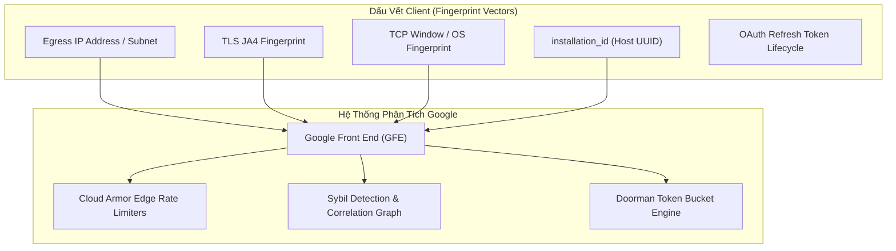

# Hướng Dẫn Kỹ Thuật: Chống Ban & Phòng Ngừa Gắn Cờ Từ Google

Tài liệu này phân tích chi tiết các cơ chế phát hiện lạm dụng (Abuse & Sybil Detection) của Google đối với dịch vụ Gemini / Code Assist / Antigravity và lý do tại sao kiến trúc của `agy-supervisor` an toàn tuyệt đối.

---

## 1. Cơ Chế Kiểm Duyệt Của Google Front End (GFE) & Sybil Engine

Google áp dụng hệ thống phân tích đồ thị tương quan đa chiều (Multi-Dimensional Correlation Graph) để giám sát các tài nguyên API:



### Các thuật toán giám sát cốt lõi:
1. **SybilRank & EagleMine**: Phát hiện các cụm tài khoản (Identity Clusters) có hành vi phối hợp tự động để vượt qua các chính sách giới hạn tài nguyên (Policy Bypassing).
2. **Doorman / Bandwidth Engine**: Quản lý các Token Bucket trượt theo thời gian thực (RPM/RPD).
3. **Cloud Armor Rate Limiters**: Đếm tỷ lệ lỗi $\frac{4xx}{2xx}$ trong sliding window để kích hoạt CAPTCHA challenge hoặc IP Blackholing.

---

## 2. Các Cờ Đỏ (Red Flags) & Giải Pháp Kỹ Thuật Của `agy-supervisor`

### 2.1 Cờ Đỏ 1: Hiện Tượng Đổi Tài Khoản Siêu Tốc (Fast Failover Anomaly: $t_{\Delta} < 50\text{ms}$)
* **Hiện tượng**: Khi Slot 1 nhận mã lỗi HTTP `429` (Rate Limit) ở thời điểm $T_0$, và Slot 2 lập tức gửi request nối tiếp ở $T_0 + 20\text{ms}$ trên cùng IP và TLS stack.
* **Đánh giá của máy quét**: Hành vi con người không thể đổi tài khoản trong 20 mili-giây. Đây là dấu hiệu của botnet / automated script đang khai thác chéo quota lậu.
* **Khắc phục trong `agy-supervisor`**:
  Supervisor luôn áp dụng **Handover Delay an toàn $\ge 2.0\text{s}$**:
  ```python
  # Anti-Abuse: enforce minimum handover gap (>= 2.0s)
  time.sleep(2.0)
  self.apply_slot(next_slot)
  ```
  Khoảng nghỉ này phá vỡ tương quan thời gian tức thì trên đồ thị của Sybil Engine, mô phỏng đúng độ trễ thao tác chuyển đổi profile thông thường của lập trình viên.

---

### 2.2 Cờ Đỏ 2: Sinh Ngẫu Nhiên `installation_id`
* **Hiện tượng**: Một số công cụ tự động tạo mới `installation_id` (UUID) mỗi khi xoay tài khoản.
* **Đánh giá của máy quét**: Trong khi `installation_id` thay đổi liên tục, thì địa chỉ IP, card mạng, hệ điều hành Linux, kích thước TCP Window và TLS JA4 Fingerprint lại hoàn toàn trùng khớp. Google sẽ coi đây là **Active Evasion Artifact** (hành vi cố tình giả mạo phần cứng), mang trọng số phạt cực cao (10x Ban Risk).
* **Khắc phục trong `agy-supervisor`**:
  Supervisor **giữ nguyên 1 `installation_id` duy nhất** của máy tính trạm. Trong mô hình hoạt động của Google, một máy tính của lập trình viên chứa nhiều tài khoản Google (cá nhân, cơ quan, nghiên cứu) là hoàn toàn tự nhiên và hợp lệ.

---

### 2.3 Cờ Đỏ 3: Bão Lỗi 4xx (The 4xx Thrashing Storm)
* **Hiện tượng**: Khi toàn bộ tài khoản đều đã hết quota ngày, script tiếp tục xoay vòng liên tục:
  $$1 \to 2 \to 3 \to 1 \to 2 \dots$$
  Hàng trăm request trả về HTTP 429 dồn dập trong 1 phút.
* **Đánh giá của máy quét**: Tỷ lệ lỗi $\frac{4xx}{2xx}$ tăng đột biến sẽ kích hoạt hệ thống chống DDoS của Cloud Armor. Hậu quả là IP bị đưa vào blacklist và tài khoản có nguy cơ bị thu hồi quyền truy cập (`CREDENTIAL_REVOKED`).
* **Khắc phục trong `agy-supervisor`**:
  Tích hợp **Master Circuit Breaker**:
  ```python
  if not available:
      # Circuit breaker: ALL configured accounts are exhausted
      min_wait = min(self.state.get("slots", {}).get(str(i), {}).get("exhausted_until", now + 3600) for i in all_slots)
      wait_seconds = max(10, min_wait - now)
      # Thoát Alternate Screen Buffer trước khi in cảnh báo
      guard.restore()
      sys.stdout.write(f"\r\n[!] CIRCUIT BREAKER: Toàn bộ {len(all_slots)} tài khoản đều đã cạn quota!\r\n")
      return ""
  ```
  Supervisor dừng ngay lập tức việc gửi request, tính toán thời gian chờ đến giờ reset tiếp theo và bảo vệ an toàn cho toàn bộ tài khoản.

---

### 2.4 Cờ Đỏ 4: Lỗi Máy Chủ Quá Tải (HTTP 503 / UNAVAILABLE)
* **Hiện tượng**: Vào các khung giờ cao điểm, cụm server phục vụ model Gemini có thể bị quá tải và trả về mã lỗi HTTP 503 (`Service Unavailable: Model Overloaded`) hoặc gRPC Status 14 (`UNAVAILABLE`).
* **Khắc phục trong `agy-supervisor`**:
  Thay vì để CLI bị crash hoặc kẹt đợi, supervisor nhận diện mã lỗi 503/UNAVAILABLE và thực hiện xoay sang tài khoản tiếp theo để định tuyến sang vùng xử lý backend khác.

---

### 2.5 Cờ Đỏ 5: Mất Đồng Bộ Refresh Token (OAuth Token Desync)
* **Hiện tượng**: Google tự động làm mới `access_token` và `id_token` sau mỗi 45-60 phút và ghi vào `~/.gemini/oauth_creds.json`. Nếu supervisor không đồng bộ ngược lại slot archive, khi xoay vòng lại sẽ nạp token cũ đã hết hạn.
* **Khắc phục trong `agy-supervisor`**:
  Hàm `sync_back_current()` luôn được gọi trước mỗi lần hoán đổi slot và khi phiên kết thúc bình thường, đảm bảo token mới nhất luôn được lưu giữ an toàn.

---

## 3. Phân Biệt Quota Phút (RPM) Và Quota Ngày (RPD)

| Tiêu chí | Quota Phút (RPM / TPM) | Quota Ngày (RPD / TPD) |
| :--- | :--- | :--- |
| **Bản chất** | Giới hạn tốc độ gửi tin nhắn trong 1 phút | Hạn mức sử dụng token/request tối đa trong ngày |
| **Thời gian phục hồi** | **30–60 giây** (hồi phục theo bucket) | **Reset vào 00:00 PST/PDT (khoảng 14:00/15:00 giờ VN)** |
| **Mã lỗi trả về** | HTTP 429 (`rateLimitExceeded`) | HTTP 429 (`Individual quota reached. Resets in XhYm`) |
| **Chiến lược xử lý** | Giữ phiên, nghỉ 30-60s | Chuyển ngay sang tài khoản tiếp theo trong pool |

`agy-supervisor` tính toán chính xác thời điểm reset quota theo múi giờ `America/Los_Angeles` (00:05 PST ngày hôm sau) có xử lý Daylight Saving Time (DST) để quản lý trạng thái `EXHAUSTED_DAILY`, không bao giờ xoay lại các tài khoản đã hết quota ngày trước giờ reset.
