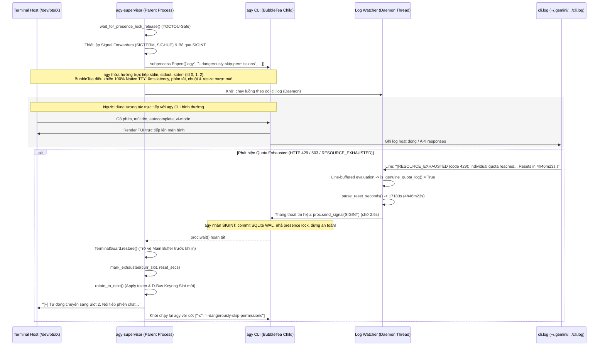

# Architecture & Systems Engineering Deep-Dive

Tài liệu này phân tích chi tiết cấu trúc kỹ thuật tầng thấp (Low-Level Systems Engineering), cơ chế giao tiếp liên tiến trình (IPC), nhân Linux TTY, và chiến lược xử lý dữ liệu của `agy-supervisor`.

---

## 1. Mô Hình Thực Thi TTY & Quản Lý Tín Hiệu (Linux Kernel & Terminal Execution)

### 1.1 Hạn Chế Chết Người Của Việc Bọc TUI Qua PTY Proxy Hoặc Script
Antigravity CLI (`agy`) sử dụng framework giao diện TUI **BubbleTea** (viết bằng Go). Khi BubbleTea khởi động:
1. Đưa terminal vào chế độ **Raw Mode**: xóa các cờ `ICANON` (không chờ phím Enter), `ECHO` (không tự in ký tự gõ), và `OPOST` (xử lý output thủ công).
2. Phát chuỗi ANSI **`\x1b[?1049h` (`smcup`)** để chuyển toàn bộ màn hình sang Alternate Screen Buffer, và **`\x1b[?25l`** để ẩn con trỏ chuột.

Khi xây dựng trình giám sát (Supervisor), có hai cạm bẫy kinh điển:
* **Cạm bẫy PTY Proxy thiếu raw mode**: Nếu mở một PTY master/slave nhưng không đặt `sys.stdin` của tiến trình cha vào raw mode (`tty.setraw()`), driver TTY của hệ điều hành vẫn ở chế độ canonical (cooked mode). Toàn bộ phím gõ, mũi tên điều hướng, autocomplete sẽ bị đóng băng hoặc in ra ký tự rác (`^[[A`) cho đến khi bấm Enter. Việc dùng vòng lặp `select.select()` ở tiến trình cha còn tạo ra độ trễ I/O (latency) và dễ bị lỗi desync kích thước màn hình (`SIGWINCH`).
* **Cạm bẫy Background Process Group (`SIGTTIN` / `SIGTTOU`)**: Nếu chạy `agy &` trong background, nhân Linux sẽ gửi tín hiệu **`SIGTTIN`** hoặc **`SIGTTOU`**, lập tức dừng tiến trình.

### 1.2 Kiến Trúc Tối Ưu: Direct Foreground Execution + Daemon Log Watcher
`agy-supervisor` áp dụng mô hình thực thi trực tiếp trên Foreground TTY kết hợp luồng giám sát ngầm:



### 1.3 Thang Thoát Tín Hiệu Chống Deadlock (Signal Escalation Ladder)
Nếu child process bị crash ngầm, kẹt trong vòng lặp hoặc phớt lờ `SIGINT`, lệnh `proc.wait()` ở main thread có thể bị deadlock vĩnh viễn. Để khắc phục, watcher thread thực thi thang leo thang tín hiệu:
```python
# Watcher thread signal escalation:
proc.send_signal(signal.SIGINT)
for _ in range(25): # Chờ tối đa 2.5 giây
    if proc.poll() is not None:
        break
    time.sleep(0.1)
else:
    proc.terminate() # Gửi SIGTERM nếu SIGINT bị phớt lờ
    for _ in range(10): # Chờ tiếp 1.0 giây
        if proc.poll() is not None:
            break
        time.sleep(0.1)
    else:
        proc.kill() # Ép buộc ngắt bằng SIGKILL
```

Đồng thời, tiến trình cha đăng ký forwarder cho `SIGTERM` và `SIGHUP` để không bao giờ để lại tiến trình con mồ côi (orphan process) khi terminal bị tắt.

### 1.4 Phục Hồi Bộ Đệm Màn Hình An Toàn (`TerminalGuard`)
Class `TerminalGuard` lưu cấu hình `termios` gốc trước khi khởi chạy và phát chuỗi escape phục hồi chuẩn ANSI:
```python
def restore(self):
    if self.is_tty and self.orig_termios:
        try:
            termios.tcsetattr(sys.stdin.fileno(), termios.TCSANOW, self.orig_termios)
        except Exception:
            pass
    if sys.stdout.isatty():
        # Thoát Alternate Screen Buffer (\x1b[?1049l), hiện con trỏ (\x1b[?25h), tắt chuột & bracketed paste
        sys.stdout.write("\x1b[?1049l\x1b[?25h\x1b[?1000l\x1b[?1002l\x1b[?1006l\x1b[?2004l\r\n")
        sys.stdout.flush()
```
> [!IMPORTANT]
> `guard.restore()` luôn được gọi **trước** khi in thông báo xoay tua hoặc Circuit Breaker. Nếu in khi đang ở Alternate Screen Buffer của BubbleTea, thông báo sẽ bị cuốn trôi ngay khi buffer bị đóng lúc tiến trình thoát.

---

## 2. Engine Đọc Log Streaming & Xử Lý Cắt Khúc Ranh Giới (Line-Buffered Watcher)

### 2.1 Cạm Bẫy Cắt Đôi Từ Khóa (Chunk Boundary Slicing)
Khi đọc stream từ file descriptor bằng `read(cur_size - tracked_pos)`, các chunk byte được trả về theo buffer của hệ điều hành. Nếu một chuỗi quan trọng như `RESOURCE_EXHAUSTED` bị cắt đôi ở ranh giới giữa hai chunk:
- Chunk 1 kết thúc bằng: `... failed (RESOUR`
- Chunk 2 bắt đầu bằng: `CE_EXHAUSTED (code 429) ...`

Nếu kiểm tra từng chunk độc lập, cả hai lần đọc đều đánh giá `False`, dẫn đến **bỏ lọt lỗi (False Negative)** và hệ thống bị treo.
`agy-supervisor` triển khai bộ đệm dòng (`line_buffer`):
```python
content = line_buffer + new_bytes
lines = content.split(b"\n")
line_buffer = lines.pop() # Giữ lại phần dòng chưa hoàn thiện cho lần đọc sau

for line in lines:
    if is_genuine_quota_log(line):
        quota_detected.set()
        ...
```

### 2.2 Xử Lý Đồng Thời Trong Go (Go Concurrency Masking)
File log của `agy` ghi nhận hai Goroutine chạy song song:
```text
I0913 12:57:14.237128   28527 run.go:387] Run: attempt 1 failed (RESOURCE_EXHAUSTED (code 429): Individual quota reached. Resets in 4h46m23s.)
I0913 12:57:14.294501   28527 quota_manager.go:41] doRefreshQuota: skipped (throttled)
```
Dòng `doRefreshQuota: skipped (throttled)` xuất hiện chỉ **57ms** sau dòng báo lỗi hạn ngạch. Nếu kiểm tra false-positive trên toàn bộ khối chunk, dòng throttled sẽ vô hiệu hóa dòng lỗi quota thực sự.
`agy-supervisor` phân tách theo từng dòng (`line-by-line`) để đảm bảo không một dòng log định kỳ nào có thể che giấu sự kiện cạn kiệt quota.

### 2.3 Quản Lý Truncate & Rotation In-Place
Nếu log file bị xóa hoặc thu nhỏ (`> cli.log`), `cur_size < tracked_pos`. Supervisor tự động phát hiện tình trạng file bị thu nhỏ và lập tức reset `tracked_pos = 0`, ngăn ngừa tình trạng "mù" log.

---

## 3. Đồng Bộ D-Bus Secret Service (GNOME Keyring)

### 3.1 Cơ Chế Lưu Token Của Thư Viện `go_keyring`
Nhị phân `agy` tích hợp thư viện Go `github.com/zalando/go_keyring`. Trên Linux Desktop:
1. `agy` lưu trữ token đăng nhập trong GNOME Keyring với định danh:
   - **Service**: `gemini`
   - **Username**: `antigravity`
   - **Schema**: `org.freedesktop.Secret.Generic`
2. **Thứ Tự Ưu Tiên**: Khi khởi động, `agy` kiểm tra GNOME Keyring **trước**. Nếu tìm thấy token trong Keyring, nó sẽ bỏ qua file `~/.gemini/oauth_creds.json`.

### 3.2 Giải Pháp In-Place Update Thay Vì Tạo Trùng Lặp
Thay vì gọi `CreateItem` có thể gây tràn/nhân bản mục trong Keyring trên một số bản phân phối Linux:
1. Supervisor kiểm tra xem mục `service=gemini, username=antigravity` đã tồn tại chưa bằng `get_keyring_item(bus)`.
2. Nếu đã tồn tại: gọi phương thức D-Bus `item_obj.SetSecret(...)` để cập nhật trực tiếp tại chỗ (In-place Update).
3. Nếu chưa tồn tại: mở collection và tạo mới với `CreateItem(..., replace=True)`.
4. Hỗ trợ dự phòng đường dẫn collection: thử `/org/freedesktop/secrets/aliases/default` trước, nếu thất bại sẽ fallback sang `/org/freedesktop/secrets/collection/login`.

---

## 4. Quản Lý File Lock & Cơ Sở Dữ Liệu SQLite WAL

### 4.1 Presence Advisory Lock
Mỗi phiên làm việc của `agy` giữ một file lock advisory qua `flock`:
```text
~/.gemini/antigravity-cli/presence/<conversation_id>.lock
```
Nếu tiến trình `agy -c` mới được spawn trước khi kernel dọn xong file descriptor của tiến trình cũ, tiến trình mới sẽ bị từ chối truy cập. Supervisor sử dụng hàm `wait_for_presence_lock_release(timeout=3.0)` với cơ chế bắt ngoại lệ `FileNotFoundError` (chống TOCTOU race condition) để chờ lock được giải phóng hoàn toàn.

### 4.2 SQLite WAL Checkpointing
Cơ sở dữ liệu lưu trữ lịch sử hội thoại `conversation_summaries.db` và `conversations/<uuid>.db` hoạt động ở chế độ Write-Ahead Logging (`-wal` và `-shm`). Việc gửi `SIGINT` trước khi ngắt giúp tiến trình Go flush toàn bộ WAL frame xuống database chính và đóng kết nối an toàn, loại bỏ hoàn toàn nguy cơ gặp lỗi `database is locked` (`SQLITE_BUSY`).

---

## 5. Tính Toàn Vẹn Dữ Liệu (Atomic State Persistence)

Tất cả các thay đổi trạng thái trong `supervisor_state.json` đều tuân thủ nguyên tắc ghi nguyên tử:
1. Dữ liệu JSON được ghi ra file tạm `.tmp`.
2. Gọi `f.flush()` và ép xả xuống phiến đĩa vật lý bằng `os.fsync(f.fileno())`.
3. Thay thế file đích bằng hàm POSIX `os.replace(tmp_file, target_file)`.

Cơ chế này bảo đảm `supervisor_state.json` không bao giờ rơi vào trạng thái 0 bytes hoặc JSON hỏng nếu máy tính bị sập nguồn đột ngột.

---

## 6. Pipeline Lọc Tham Số Dòng Lệnh Khi Nối Tiếp Phiên

Khi chuyển từ phiên thông thường sang phiên nối tiếp (`is_continue = True`):
1. Cờ `--dangerously-skip-permissions` luôn được bảo đảm chèn vào danh sách lệnh.
2. Cờ `-c` được chèn vào đầu để kích hoạt chế độ continue.
3. Các cờ cấu hình môi trường chạy kèm giá trị (`--model`, `-m`, `--effort`, `-e`, `--agent`, `-a`, `--project`, `--mode`, `--add-dir`, `--conversation`) được bảo lưu toàn vẹn.
4. Các cờ thực thi prompt một lần (`-p`, `--print`, `--prompt`, `-i`, `--prompt-interactive`) được lược bỏ sạch sẽ, tránh hiện tượng prompt cũ bị gửi lặp lại trong phiên chat mới.
