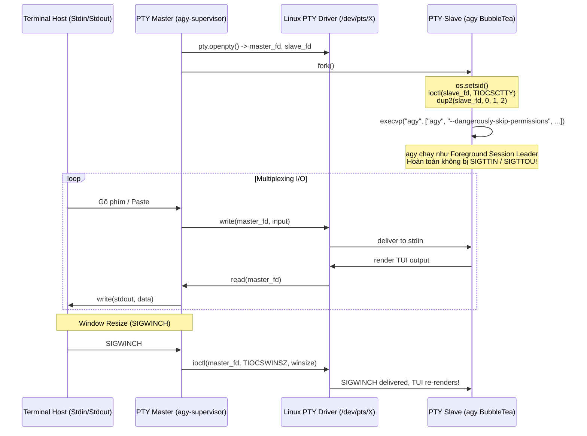
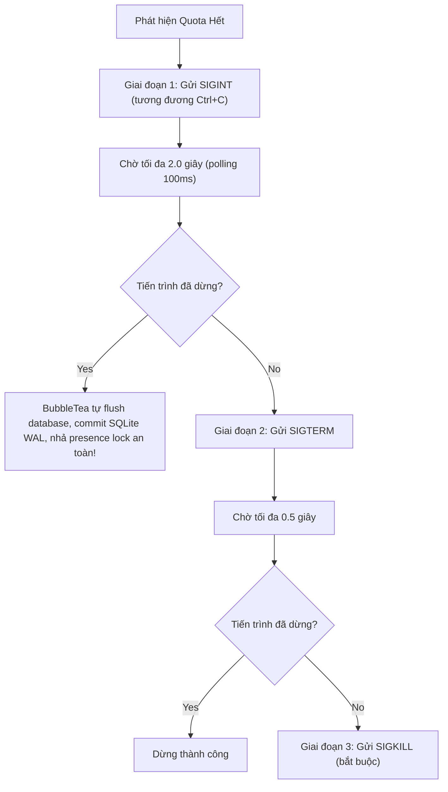

# Architecture & Systems Engineering Deep-Dive

Tài liệu này phân tích chi tiết cấu trúc kỹ thuật tầng thấp (Low-Level Systems Engineering) của `agy-supervisor`.

---

## 1. Vấn Đề Nhân Linux & Terminal Emulation (PTY Master/Slave)

### Hạn chế khi chạy TUI trong Bash Script thông thường
Antigravity CLI (`agy`) sử dụng framework giao diện TUI **BubbleTea** (viết bằng Go). Khi BubbleTea khởi động:
1. Nó đưa terminal vào chế độ **Raw Mode**: xóa các cờ `ICANON` (không chờ Enter mới đọc), `ECHO` (không tự in ký tự gõ), và `OPOST` (xử lý output thủ công).
2. Nó phát chuỗi ANSI **`\x1b[?1049h` (`smcup`)** để chuyển toàn bộ màn hình sang Alternate Screen Buffer, và **`\x1b[?25l`** để ẩn con trỏ chuột.

Nếu dùng một script Bash thông thường để bọc `agy`:
* **Lỗi `SIGTTIN` / `SIGTTOU`**: Khi chạy `agy &` trong background, nhân Linux phân loại tiến trình vào một Background Process Group. Bất kỳ lệnh `read()` nào từ terminal sẽ khiến tty line discipline của Linux gửi tín hiệu **`SIGTTIN`**, dừng tiến trình ngay lập tức. Bất kỳ lệnh `tcsetattr()` nào cũng gửi **`SIGTTOU`**, làm đóng băng ứng dụng.
* **Lỗi Terminal Corrupted**: Nếu gửi `kill -TERM` trực tiếp đến `agy`, tiến trình bị ép dừng trước khi hàm dọn dẹp `p.RestoreTerminal()` của BubbleTea kịp chạy. Kết quả là terminal của người dùng bị kẹt ở Alternate Screen, mất con trỏ, mất echo, và các ký tự xuống dòng bị lệch hình bậc thang.

### Giải pháp PTY Master/Slave trong `agy-supervisor`
`agy-supervisor` sử dụng mô hình Pseudo-Terminal chuẩn POSIX thông qua module `pty` của Python:



#### Bảo vệ trạng thái Terminal bằng RAII (`TerminalGuard`)
Class `TerminalGuard` lưu cấu hình `termios` gốc trước khi khởi chạy và cam kết phục hồi trong khối `finally:`:
```python
class TerminalGuard:
    def __enter__(self):
        if self.is_tty:
            self.orig_termios = termios.tcgetattr(sys.stdin.fileno())
        return self

    def __exit__(self, exc_type, exc_val, exc_tb):
        self.restore()

    def restore(self):
        if self.is_tty and self.orig_termios:
            termios.tcsetattr(sys.stdin.fileno(), termios.TCSANOW, self.orig_termios)
        # Phát chuỗi ANSI khôi phục toàn diện:
        sys.stdout.write("\x1b[?1049l\x1b[?25h\x1b[?1000l\x1b[?1002l\x1b[?1006l\x1b[?2004l\r\n")
        sys.stdout.flush()
```

---

## 2. Tích Hợp D-Bus Secret Service (GNOME Keyring)

### Cơ chế lưu token ngầm của `agy`
Dịch ngược nhị phân ELF của `agy` cho thấy sự hiện diện của thư viện Go:
```text
google3/third_party/golang/github_com/zalando/go_keyring
```
Trên các bản phân phối Linux Desktop có GNOME hoặc Secret Service:
1. `agy` lưu trữ token đăng nhập trong GNOME Keyring với định danh:
   - **Service**: `gemini`
   - **Username**: `antigravity`
   - **Schema**: `org.freedesktop.Secret.Generic`
2. **Thứ tự ưu tiên**: Khi khởi động, `agy` kiểm tra GNOME Keyring **trước**. Nếu tìm thấy token trong Keyring, nó sẽ bỏ qua file `~/.gemini/oauth_creds.json`.

### Cách xử lý của `agy-supervisor`
`agy-supervisor` giao tiếp trực tiếp với D-Bus Session Bus (`org.freedesktop.secrets`):
* **Khi đăng nhập tài khoản mới (`agy-supervisor login <N>`)**:
  Supervisor gọi `item.Delete()` trên D-Bus để gỡ bỏ hoàn toàn credential cũ khỏi GNOME Keyring, đồng thời xóa file tạm `~/.gemini/oauth_creds.json`. `agy` khởi động trong trạng thái hoàn toàn "sạch", buộc phải mở trình duyệt cho bạn đăng nhập tài khoản mới.
* **Khi xoay vòng tài khoản (`apply_slot`)**:
  Supervisor đọc `keyring_secret.json` tương ứng của slot và gọi `col.CreateItem()` để ghi đè token vào GNOME Keyring, đồng thời ghi đè file JSON trong `~/.gemini/`. Điều này đảm bảo tính nhất quán 100% dù `agy` đọc từ nguồn nào.

---

## 3. Quy Trình Ngắt An Toàn 2 Giai Đoạn (Staged Shutdown)

Khi phát hiện cạn kiệt quota, việc ngắt đột ngột bằng `SIGKILL` hoặc `SIGTERM` có thể làm hỏng trạng thái cơ sở dữ liệu. `agy-supervisor` áp dụng quy trình ngắt có kiểm soát:



---

## 4. Quản Lý File Lock & Tranh Chấp SQLite WAL

### Presence Lock
Mỗi phiên làm việc của `agy` giữ một file lock độc quyền dạng advisory lock qua `flock`:
```text
~/.gemini/antigravity-cli/presence/<conversation_id>.lock
```
Nếu tiến trình `agy -c` mới được spawn trước khi kernel dọn xong file descriptor của tiến trình cũ, tiến trình mới sẽ bị `EWOULDBLOCK`.
`agy-supervisor` tích hợp hàm kiểm tra trước khi spawn:
```python
def wait_for_presence_lock_release(self, timeout=3.0) -> bool:
    start = time.time()
    while time.time() - start < timeout:
        locked = False
        if PRESENCE_DIR.exists():
            for lock_file in PRESENCE_DIR.glob("*.lock"):
                try:
                    with open(lock_file, "r") as f:
                        fcntl.flock(f.fileno(), fcntl.LOCK_EX | fcntl.LOCK_NB)
                        fcntl.flock(f.fileno(), fcntl.LOCK_UN)
                except (BlockingIOError, OSError):
                    locked = True
                    break
        if not locked:
            return True
        time.sleep(0.1)
    return False
```

### SQLite WAL
Database `conversation_summaries.db` và `conversations/<uuid>.db` hoạt động ở chế độ Write-Ahead Logging (`-wal` và `-shm`). Việc gửi `SIGINT` trước giúp SQLite driver của Go tự động thực hiện checkpoint và đóng kết nối sạch sẽ, ngăn ngừa triệt để lỗi `SQLITE_BUSY`.
